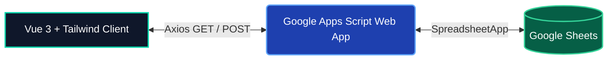

<div align="center">

# PTC Monitor Dashboard

**Pharmacy and Therapeutics Committee (PTC) Quality Improvement Tracker**
Originally developed for Sabot Hospital

[](https://vuejs.org/)
[](https://www.typescriptlang.org/)
[](https://vitejs.dev/)
[](https://tailwindcss.com/)
[](https://pinia.vuejs.org/)
[](https://developers.google.com/apps-script)
[](https://vercel.com/)

[Report Bug](https://github.com/pharmacist-sabot/ptc-dashboard/issues) · [Request Feature](https://github.com/pharmacist-sabot/ptc-dashboard/issues)

</div>

---

**PTC Monitor Dashboard** is a lightweight, serverless web application designed to track the progress of quality improvement plans within the Pharmacy Department. Built with **Vue 3** and **TypeScript**, it utilizes **Google Sheets** as a zero-cost database via **Google Apps Script (GAS)**, making it incredibly easy to deploy and maintain within healthcare organizations without requiring traditional backend infrastructure.

---

## Table of Contents

- [Overview & Features](#overview--features)
- [System Architecture](#system-architecture)
- [Getting Started](#getting-started)
  - [1. Frontend Setup](#1-frontend-setup)
  - [2. Backend Setup (Google Apps Script)](#2-backend-setup-google-apps-script)
- [Deployment](#deployment)
- [Database Schema](#database-schema)
- [Security & Privacy](#security--privacy)
- [Contributing](#contributing)
- [License & Disclaimer](#license--disclaimer)

---

## Overview & Features

This dashboard helps the PTC team track the status and progress of 12 critical actions across 3 improvement proposals.

- **Clinical Dark Interface:** Designed for extended professional use with a high-contrast dark theme, custom EKG pulse animations, and integrated sparkline charts.
- **Optimistic UI Updates:** Instant visual feedback when updating action statuses or progress, ensuring a responsive user experience while background synchronization occurs.
- **Interactive Visualizations:** Features an automated Gantt chart for fiscal year tracking and a dynamic summary dashboard reflecting real-time progress.
- **Smart Alerting:** Automatically filters and highlights tasks marked as "Blocked" or "Delayed" for immediate managerial attention.
- **Zero-Cost Infrastructure:** Uses a Google Apps Script Web App to read and write directly to a Google Sheet, completely eliminating the need for server maintenance.

---

## System Architecture



- **Frontend:** Single Page Application (SPA) hosted on Vercel. Communicates via standard JSON APIs.
- **Backend (GAS):** Parses HTTP requests, bypasses CORS preflight limitations using `application/x-www-form-urlencoded`, and executes read/write operations.
- **Database:** Google Sheets (Sheet name: `ActionProgress`).

---

## Getting Started

### Prerequisites

- [Node.js](https://nodejs.org/) (v18 or higher)
- A Google Account (to create the backing Google Sheet and Apps Script)

### 1. Frontend Setup

1. Clone the repository and install dependencies:
   ```bash
   git clone https://github.com/pharmacist-sabot/ptc-dashboard.git
   cd ptc-dashboard
   npm install
   ```
2. Set up your local environment variables:
   ```bash
   cp .env.example .env.local
   ```
3. Start the development server (Note: You must complete the GAS setup below and update `VITE_GAS_URL` in your `.env.local` before the app can fetch data):
   ```bash
   npm run dev
   ```

### 2. Backend Setup (Google Apps Script)

1. Create a new **Google Sheet**.
2. Navigate to **Extensions > Apps Script**.
3. Replace the default code with the contents of [`src/gas/Code.gs`](src/gas/Code.gs).
4. Save the project.
5. Click **Deploy > New deployment**.
   - **Select type:** Web app
   - **Execute as:** Me (your email address)
   - **Who has access:** Anyone
6. Click **Deploy** and authorize the required permissions.
7. Copy the generated **Web app URL**.
8. Paste the URL into your `.env.local` file:
   ```env
   VITE_GAS_URL=https://script.google.com/macros/s/YOUR_DEPLOYMENT_ID/exec
   ```

---

## Deployment

The project is pre-configured for seamless deployment on **Vercel** via the included `vercel.json` file.

[](https://vercel.com/new/clone?repository-url=https%3A%2F%2Fgithub.com%2FYOUR_ORG%2Fptc-dashboard&env=VITE_GAS_URL)

**Manual Vercel Deployment:**

1. Push your code to a GitHub repository.
2. Import the repository into your Vercel dashboard.
3. Ensure the Framework Preset is set to **Vite**.
4. In the **Environment Variables** section, add:
   - Name: `VITE_GAS_URL`
   - Value: `[Your GAS Web App URL]`
5. Click **Deploy**.

---

## Database Schema

Upon the first API execution, the Google Apps Script will automatically generate a sheet named `ActionProgress` with the following columns:

| Column        | Type     | Description                                                     |
| :------------ | :------- | :-------------------------------------------------------------- |
| `id`          | String   | Unique action identifier (e.g., `R1A1`, `R2A3`)                 |
| `status`      | String   | `not_started`, `in_progress`, `completed`, `delayed`, `blocked` |
| `progressPct` | Number   | Completion percentage (0-100)                                   |
| `actualValue` | String   | The actual recorded KPI value                                   |
| `notes`       | String   | Free-text operational notes                                     |
| `blockers`    | String   | Documented risks or obstacles                                   |
| `lastUpdated` | ISO Date | Timestamp of the last modification                              |
| `updatedBy`   | String   | Identifier of the user making the update                        |

---

## Security & Privacy

- **Data Sensitivity:** This application is strictly intended for tracking operational processes and policy implementation. **Do not** store Protected Health Information (PHI), patient identifiers, or highly confidential institutional data in this system.
- **Endpoint Protection:** Treat your GAS Web App URL as a sensitive credential. Do not commit it to public version control. Utilize proper secret management (e.g., Vercel Environment Variables).
- **Access Control:** Restrict the sharing permissions of the backend Google Sheet to authorized personnel only.

---

## Contributing

Contributions to improve the application architecture, UI, or backend scripts are welcome.

1. Fork the Project
2. Create your Feature Branch (`git checkout -b feature/AmazingFeature`)
3. Commit your Changes (`git commit -m 'Add some AmazingFeature'`)
4. Push to the Branch (`git push origin feature/AmazingFeature`)
5. Open a Pull Request

---

## License & Disclaimer

- This project was originally developed for internal process management at the **Sabot Hospital Pharmacy Department**.
- The source code is provided as an open-source reference and can be adapted for your institution's requirements.
- **Disclaimer:** The authors and associated institutions accept no liability for data loss, breaches, or operational failures resulting from the use or misconfiguration of this software. Always ensure compliance with your local healthcare data governance policies.
