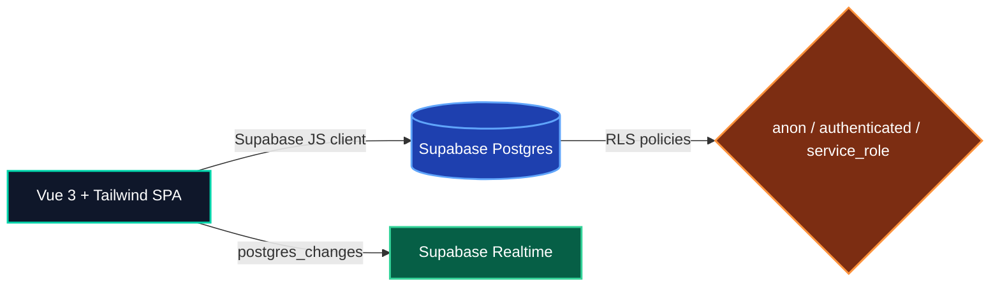

# PTC Monitor Dashboard

**Pharmacy and Therapeutics Committee (PTC) Quality Improvement Tracker**
Originally developed for Sa Bot Hospital

[](https://vuejs.org/)
[](https://www.typescriptlang.org/)
[](https://vitejs.dev/)
[](https://tailwindcss.com/)
[](https://pinia.vuejs.org/)
[](https://supabase.com/)
[](https://biomejs.dev/)
[](https://bun.sh/)
[](https://vercel.com/)

[Report Bug](https://github.com/suradet-ps/ptc-dashboard/issues) · [Request Feature](https://github.com/suradet-ps/ptc-dashboard/issues)

---

**PTC Monitor Dashboard** is a lightweight, serverless web application designed to track the progress of quality improvement plans within the Pharmacy Department. Built with **Vue 3** and **TypeScript**, it uses **Supabase** (Postgres + Row Level Security + Realtime) as a fully managed backend, removing the need to host or maintain any server infrastructure.

---

## Table of Contents

- [Overview & Features](#overview--features)
- [System Architecture](#system-architecture)
- [Getting Started](#getting-started)
  - [1. Frontend Setup](#1-frontend-setup)
  - [2. Backend Setup (Supabase)](#2-backend-setup-supabase)
- [Deployment](#deployment)
- [Database Schema](#database-schema)
- [Project Structure](#project-structure)
- [Security & Privacy](#security--privacy)
- [Contributing](#contributing)
- [License & Disclaimer](#license--disclaimer)

---

## Overview & Features

This dashboard helps the PTC team track the status and progress of 12 critical actions across 3 improvement proposals.

- **Clinical Dark Interface:** Designed for extended professional use with a high-contrast dark theme, custom EKG pulse animations, and integrated sparkline charts.
- **Optimistic UI Updates:** Instant visual feedback when updating action statuses or progress, with automatic rollback if the remote write fails.
- **Live Multi-User Sync:** Subscribes to `postgres_changes` on `ptc_action_progress`, so any update — from any user or device — appears in every open dashboard within a second.
- **Interactive Visualizations:** Automated Gantt chart for fiscal year tracking and a dynamic summary dashboard reflecting real-time progress.
- **Smart Alerting:** Automatically filters and highlights tasks marked as "Blocked" or "Delayed" for immediate managerial attention.
- **Managed Backend:** Postgres + RLS + Realtime on the Supabase free tier (500 MB DB, 2M realtime messages/month, 200 concurrent connections) — no servers to run.

---

## System Architecture


```mermaid
graph LR
    A[Vue 3 + Tailwind SPA] -->|Supabase JS client| B[(Supabase Postgres)]
    A -->|postgres_changes| C[Supabase Realtime]
    B -->|RLS policies| D{anon / authenticated / service_role}

    style A fill:#0f172a,stroke:#00d4aa,stroke-width:2px,color:#fff
    style B fill:#1e40af,stroke:#60a5fa,stroke-width:2px,color:#fff
    style C fill:#065f46,stroke:#34d399,stroke-width:2px,color:#fff
    style D fill:#7c2d12,stroke:#fb923c,stroke-width:2px,color:#fff
```

- **Frontend:** Single Page Application (SPA) hosted on Vercel. Talks to Supabase directly via the official JS client (`@supabase/supabase-js`).
- **Backend (Supabase):** Managed Postgres with Row Level Security, Realtime publications, and REST/PostgREST endpoints — no CORS proxy or custom API needed.
- **Auth model:** The `anon` key is safe to ship to the browser; RLS policies gate every row. See [`supabase/README.md`](supabase/README.md) for the access model.

---

## Getting Started

### Prerequisites

- [Bun](https://bun.sh/) v1.3 or higher
- A [Supabase](https://supabase.com/) account (free tier is sufficient)

### 1. Frontend Setup

1. Clone the repository and install dependencies:

   ```bash
   git clone https://github.com/suradet-ps/ptc-dashboard.git
   cd ptc-dashboard
   bun install
   ```

2. Set up your local environment variables:

   ```bash
   cp .env.example .env
   ```

3. Fill in your Supabase credentials (see [Backend Setup](#2-backend-setup-supabase) for where to find them):

   ```env
   VITE_SUPABASE_URL=https://YOUR_PROJECT.supabase.co
   VITE_SUPABASE_ANON_KEY=eyJhbGciOi...
   ```

4. Start the development server:

   ```bash
   bun run dev
   ```

### 2. Backend Setup (Supabase)

The complete schema, RLS policies, and seed data live in the [`supabase/`](supabase/) folder. The short version:

1. Create a new project at [supabase.com](https://supabase.com/) → **New project** (region: Singapore or closest to your users).
2. Open **SQL Editor** → **New query** → paste the contents of [`supabase/schema.sql`](supabase/schema.sql) → **Run**.
   - This creates all `ptc_*` tables, the `ptc_v_actions_full` view, triggers, and seeds 44 rows.
3. Open **SQL Editor** → **New query** → paste the contents of [`supabase/rls.sql`](supabase/rls.sql) → **Run**.
   - This enables Row Level Security and installs the access policies.
4. Copy your project URL and anon key from **Project Settings → API** into your `.env` file.

> The free tier covers everything this app needs (DB + Auth + Realtime). For full step-by-step instructions, Realtime setup, and the access model, see [`supabase/README.md`](supabase/README.md).

---

## Deployment

The project is pre-configured for seamless deployment on **Vercel** via the included `vercel.json` file.

[](https://vercel.com/new/clone?repository-url=https%3A%2F%2Fgithub.com%2Fsuradet-ps%2Fptc-dashboard&env=VITE_SUPABASE_URL%2CVITE_SUPABASE_ANON_KEY)

**Manual Vercel Deployment:**

1. Push your code to a GitHub repository.
2. Import the repository into your Vercel dashboard.
3. Ensure the Framework Preset is set to **Vite**.
4. In the **Environment Variables** section, add:
   - `VITE_SUPABASE_URL` — your Supabase project URL
   - `VITE_SUPABASE_ANON_KEY` — your Supabase `anon` public key
5. Click **Deploy**.

---

## Database Schema

The full schema, including every table, column, view, trigger, and seed row, lives in [`supabase/schema.sql`](supabase/schema.sql) and is documented in [`supabase/README.md`](supabase/README.md).

At a glance:

| Table | Rows | Purpose |
|---|---|---|
| `ptc_recommendations` | 3 | R1 / R2 / R3 master records |
| `ptc_actions` | 12 | R1A1..R3A4 plan data (timeline, KPIs, owners, HA reference) |
| `ptc_action_progress` | 12 | Runtime status / progress / notes (1:1 with `ptc_actions`) |
| `ptc_status_catalog` | 5 | Status config (label + Tailwind classes + hex) |
| `ptc_fiscal_months` | 12 | Fiscal year months (month 1–12 → Thai label) |
| `ptc_meetings` | — | PTC meetings (date, title, status, report URL) |
| `ptc_agendas` | — | Meeting agenda items (FK → `ptc_meetings`) |
| `ptc_v_actions_full` | view | Join of actions + progress + recommendations |

All tables use the `ptc_` prefix to stay isolated from other objects in the Supabase project.

---

## Project Structure

```
ptc-dashboard/
├── src/
│   ├── components/         Vue components (ActionCard, GanttChart, AppHeader, ...)
│   ├── views/              Route views (Dashboard, SmartPTC sub-views, print layouts)
│   ├── stores/             Pinia stores (config, dashboard, useSmartPtcStore)
│   ├── services/           Supabase client + per-table service modules
│   ├── types/              Shared TypeScript types
│   ├── router/             Vue Router config
│   ├── assets/             CSS (Tailwind entry, design tokens)
│   ├── App.vue             Root component
│   └── main.ts             App bootstrap (loads config from Supabase before mount)
├── supabase/
│   ├── schema.sql          Tables, view, triggers, seed data
│   ├── rls.sql             Row Level Security policies
│   └── README.md           Database setup guide (English)
├── .env.example            Template for VITE_SUPABASE_URL / VITE_SUPABASE_ANON_KEY
├── biome.json              Lint + format config (replaces ESLint)
├── vite.config.ts          Vite build config
├── vercel.json             Vercel deploy config (CSP, rewrites, cache headers)
└── package.json
```

**Available scripts** (via `bun run <script>`):

| Script | Description |
|---|---|
| `dev` | Vite dev server with HMR |
| `build` | Production build to `dist/` |
| `preview` | Serve the production build locally |
| `type-check` | `vue-tsc --noEmit` |
| `fmt` | `biome format --write` |
| `fmt:check` | `biome format` (no writes) |
| `lint` | `biome lint` |
| `lint:fix` | `biome lint --write` |
| `check` | `biome check` (lint + format, no writes) |
| `check:fix` | `biome check --write` (auto-fix safe issues) |
| `ci` | `biome ci` (used in CI; fails on any issue) |

---

## Security & Privacy

Please read our [Security Policy](SECURITY.md) for details on supported versions, how to report vulnerabilities, and our data sensitivity guidelines.

The frontend ships the `anon` Supabase key to the browser — this is by design. All data access is gated by Row Level Security policies (see [`supabase/rls.sql`](supabase/rls.sql)), and the `service_role` key is **never** embedded in client code.

---

## Contributing

We welcome contributions! Please refer to our [Contributing Guidelines](CONTRIBUTING.md) for details on our code of conduct, and the process for submitting pull requests to us.

---

## License & Disclaimer

- The source code in this project is licensed under the [MIT License](LICENSE).
- **Disclaimer:** This project was originally developed for internal process management at the Sa Bot Hospital Pharmacy Department. The authors and associated institutions accept no liability for data loss, breaches, or operational failures resulting from the use or misconfiguration of this software. Always ensure compliance with your local healthcare data governance policies.
